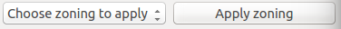
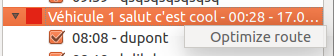

# Plugin usage
## First step
In order to use this plugin, API key and API URL have to be filled.
Clic on parameter button in plugin panel, fill parameters correctly and save.  
Next time no need to fill parameters for the same account.   

## Get API elements
Clic on connection, it will list existing plannings. Choose a planning.  
It is possible to add a map behind all layers. For that, A QGIS plugin is needed (Open Layer plugins for example)   

## Functionalities
### Create a zoning
Clic on create a zoning. Choose a name and save.   

### Edit data attributes
Choose the layer going to be modified. Clic on edit layer. Open attributes table and save after the modifications.   

### Change zone form
Choose the layer going to be modified. Clic on edit layer. Then it's possible to modify the zone form with all QGIS tools   

### Change delivery order or delivery route
Drag and drop the delivery

### Active / Deactive a delivery
Check or uncheck the delivery's box
### Apply zoning
Choose a zoning to apply and clic on apply zoning   

### Optimize a route
Right clic on a route and then clic on optimize the route   
